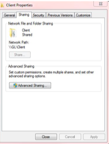
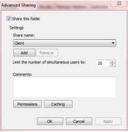
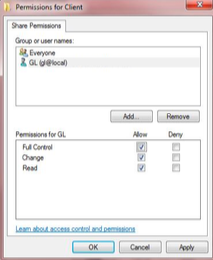
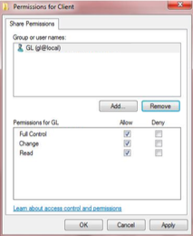

# Configuration

Once you have completed the WSUS Connector installation, the next step is configuration. The
WSUS Connector is distributed in two components: a server piece that is scheduled as a WSUS Windows sub-type job from OpCon and a client piece that actually downloads and installs the necessary updates.

### Server Configuration

The server component is scheduled through OpCon as a Microsoft LSAM job (preferably on the SAM server) and can be deployed on the SAM or any machine where it can be scheduled through Microsoft LSAM. The server piece consists of following components:

* SMAWSUS.exe 
* Taskscheduler.dll 
* CommandLine.dll

### Client Configuration

In preparation to use the WSUS Connector, you will need to make sure the client folder and its files are properly configured. The client component processes, downloads, and installs Windows updates and is run through a built-in Windows scheduler on the machine that needs to be updated.

Ideally, the client component can be deployed in a single location on the network that is accessible (through shared UNC path) to all the machines that need to use it or can be alternatively deployed on individual client machines that need to be updated. The client piece consists of following components:

* SMAMSUpdate.exe 
* CommandLine.dll

The folder needs to be shared with a user with administrative privileges on the machine that requires the Win- dows updates.

#### Share the Client Folder

1. Right-click on the Client folder.
2. Click on Properties. The **Client Properties** window displays.
3. Click the **Sharing** tab.
4. Click the **Advanced Sharing...** button.

5. In the **Advanced Sharing** window, click the **Permissions** button.
6. In the **Permissions for Client** window, click the **Add** button to add the corresponding user.

7. In the Permissions frame at the bottom of the screen, select the **Full Control** checkbox .
8. Click **Apply**.

9. After the folder has been shared, select *"Everyone"* from the **Group or user names list** then click **Remove**.
10. Click **Apply**.

### Job Output

All information produced by the job is available in the job output and can be retrieved using the **View Job Output** feature.
