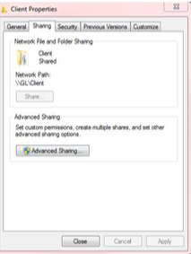
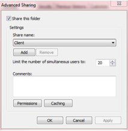
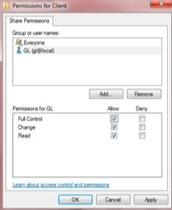
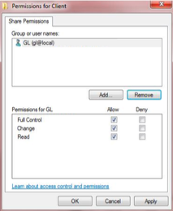

# Configuration

## What is it?

After installing the WSUS Connector, configure its two components:

* **Server component** — scheduled by OpCon as a WSUS Windows sub-type job.
* **Client component** — downloads and installs Windows updates on each target server.

Use this page to:

* Confirm where to deploy each connector component.
* Share the client folder so target servers can access the client over a UNC path.
* Locate the job output for a WSUS job.

## Server configuration

The server component is scheduled through OpCon as a Microsoft Agent job. SMA Technologies recommends running it on the SAM server, but it can run on any machine where it can be scheduled through the Microsoft Agent.

The server piece consists of:

* `SMAWSUS.exe`
* `Taskscheduler.dll`
* `CommandLine.dll`

## Client configuration

The client component processes, downloads, and installs Windows updates. It runs through a built-in Windows scheduler on the machine that needs to be updated.

The client piece consists of:

* `SMAMSUpdate.exe`
* `CommandLine.dll`

### Deployment options

You can deploy the client in one of two ways:

| Option | Where the client lives | When to use |
| ------ | ---------------------- | ----------- |
| Shared UNC path | A single location on the network, accessible to all target servers | Multiple target servers, or a centrally managed environment |
| Local install | On each individual target server | A shared path is not available or not permitted |

If you use the shared option, the folder must be shared with a user that has administrative privileges on each target server.

### Share the Client folder

To share the Client folder, complete the following steps:

1. Right-click the **Client** folder.
2. Select **Properties**. The **Client Properties** window displays.
3. Select the **Sharing** tab.
4. Select the **Advanced Sharing...** button.

   

5. In the **Advanced Sharing** window, select the **Permissions** button.
6. In the **Permissions for Client** window, select the **Add** button to add the corresponding user.

   

7. In the Permissions frame at the bottom of the screen, select the **Full Control** option.
8. Select **Apply**.

   

9. After the folder has been shared, select **Everyone** from the **Group or user names** list, then select **Remove**.
10. Select **Apply**.

    

## Job Output

All information produced by the job is captured in the job output. To retrieve the output, use the **View Job Output** feature.

## FAQs

**Where should the server component run?**
SMA Technologies recommends the SAM server, but the server component can run on any machine where it can be scheduled through the Microsoft Agent.

**Should the client component be installed on each target server?**
Either approach works. A single shared UNC location is recommended so all target servers can run the same client without duplication.

**What permissions does the shared Client folder need?**
A user with administrative privileges on each target server must have **Full Control** on the share. Remove **Everyone** from the share permissions after the configured user is added.

## Glossary

| Term | Definition |
| ---- | ---------- |
| Server component | The piece of the WSUS Connector that is scheduled by OpCon (`SMAWSUS.exe`). |
| Client component | The piece of the WSUS Connector that downloads and installs the updates on the target server (`SMAMSUpdate.exe`). |
| UNC path | Universal Naming Convention path. A path of the form `\\<server>\<share>\<resource>` used to reference shared resources across a network. |
| SAM | Schedule Activity Monitor. The OpCon component that submits and monitors job activity. |
