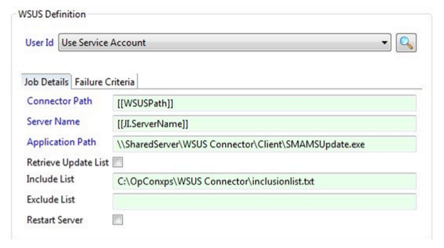
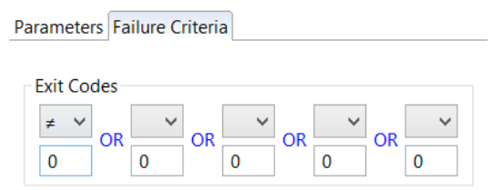
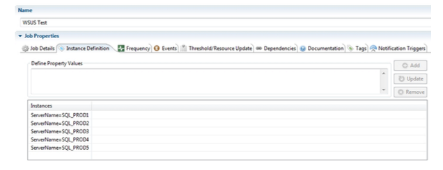
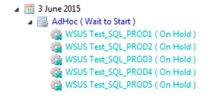

# Enterprise Manager Job Definition

## What is it?

The WSUS Connector includes a job sub-type that simplifies defining WSUS jobs in Enterprise Manager. The sub-type generates the command line for you and exposes the WSUS-specific options on the **Job Details** tab.

Use this page to:

* Define WSUS jobs in the Enterprise Manager UI.
* Configure a Multi-Instance job that applies updates to many target servers from a single definition.
* Set failure criteria for the job based on the WSUS Connector exit code.

## Define a WSUS job

To define a WSUS job in Enterprise Manager, complete the following steps:

1. Select **Windows** in the **Job Type** list.
2. Select **WSUS** in the **Job Sub-Type** list.

For more information about adding jobs, see the Enterprise Manager documentation.

## Job Details tab

The **Job Details** tab generates the WSUS command line from the values you provide.

| Field | Required | Description |
| ----- | -------- | ----------- |
| **User ID** | Yes | The user ID assigned to the job for Windows security authentication. See "User ID values" below. |
| **ConnectorPath** | Yes | The location of the server component that runs through the OpCon job. |
| **Server Name** | Yes | The server on which updates are to be checked or installed. The example screen uses a Job Instance (JI) property. |
| **Application Path** | Yes | The path to the Client component — either on the local target server or, as in the example screen, a shared UNC network path. |
| **Retrieve Update List** | No | Tells the connector to retrieve a list of available updates without installing them. If cleared, applicable updates are downloaded and installed. |
| **Include List** | No | Tells the connector to install only the updates listed in this file. |
| **Exclude List** | No | Tells the connector to install all updates for this server except those listed in this file. |

### User ID values

Use the **User ID** value that matches how the Microsoft Agent is running on the target machine:

| If the Microsoft Agent is running as... | Set User ID to... |
| --------------------------------------- | ----------------- |
| A Domain User | `UseServiceAccount` |
| The Local System | A specific Domain User |

If the User ID does not list the Domain User, register the Domain User in Enterprise Manager first.

For more information about running the Microsoft Agent as a Domain User or as the Local System, see [Service Configuration Options](https://help.smatechnologies.com/opcon/agents/windows/administration/service-configuration) in the Microsoft Agent documentation.

### Recommended pattern: Multi-Instance job

The example **WSUS Job Definition Screen** shows the recommended way to configure the WSUS job: a Multi-Instance job with Server Name as an instance property. A single OpCon job definition can then be used for any number of target servers.

## Failure Criteria tab

The **Failure Criteria** tab determines whether OpCon reports the job as Failed.

* By default, **any non-zero return code is considered Failed**.
* You can define up to **five** custom failure criteria. If any criterion evaluates TRUE at the end of the job, OpCon reports the job as Failed.

Each failure criterion consists of:

| Part | Description |
| ---- | ----------- |
| **Operator** | Comparison applied to the exit code. See "Operators" below. |
| **Exit Code Integer** | Any integer from `-2,147,483,648` through `2,147,483,647` to compare with the job's exit code. |

### Operators

| Operator | Meaning |
| -------- | ------- |
| **EQ** | Equal to |
| **NE** | Not equal to |
| **LT** | Less than |
| **GT** | Greater than |
| **GE** | Greater than or equal to |
| **LE** | Less than or equal to |

## Job Instance Definition

The **Job Instance Definition** screen below shows the instance definitions for Server Name. The example uses five SQL Servers.

When the schedule containing the WSUS job is built, OpCon produces a separate built job for each instance. Each built job runs independently and reports back the result of the update for that server.

The result of the update process for each server is reflected in a WSUS exit code. For the full list, see [Reference Information](reference-information).

You can use OpCon events to react to specific exit codes — for notification, escalation, or follow-up actions.

To view the output from the connector for a specific job, right-click the job and select **View Job Output**.

:::tip Strategy

Consider using a separate WSUS job for each server type (for example, production SQL servers versus QA servers).

:::

## FAQs

**What is the recommended way to apply updates to many servers?**
A Multi-Instance job with Server Name as an instance property. One job definition then produces one built job per target server.

**How does OpCon decide if the job failed?**
By default, any non-zero exit code is Failed. You can also define up to five custom failure criteria using **Operator** and **Exit Code Integer** on the Failure Criteria tab.

**Where do I see what happened on a specific server?**
Right-click the built job for that server and select **View Job Output**. A complete list of exit codes is available in [Reference Information](reference-information).

## Glossary

| Term | Definition |
| ---- | ---------- |
| Multi-Instance job | An OpCon job definition with one or more instance properties. When the schedule is built, OpCon produces one job per instance. |
| Job Instance (JI) property | A property whose value differs across the instances of a Multi-Instance job — for the WSUS Connector, typically the target Server Name. |
| Failure criterion | An Operator and Exit Code Integer pair that OpCon evaluates against the job's exit code to determine if the job is Failed. |
| Connector Path | The location of the WSUS Connector server component (`SMAWSUS.exe`) that the OpCon job runs. |
