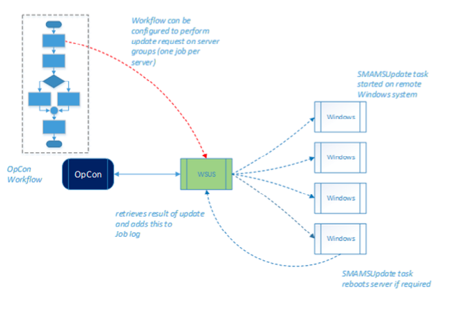

# Implementation

The WSUS Connector is comprised of two components. A server part, which is scheduled as a WSUS Win- dows sub-type job from OpCon and a client part that actually checks, downloads and installs the necessary updates on the target server.

The Windows Updates Library does not allow you to download or install Windows updates with a remote logon token - the task has to run as a locally logged on user (or Local System Account). This is achieved by using the built-in WINAT scheduler on the target server.

When the connector starts up, it schedules a task on the target server to run one minute later to check and optionally download and install updates. It then keeps on monitoring the status of this scheduled task.

Once the scheduled task (SMAMSUpdate) is started, it checks for Windows updates and optionally downloads and installs them. The log of all this activity is retained in-memory.

When SMAMSUpdate completes, it opens a Named Pipe connection in listening mode. The
WSUS Connector connects to this Named Pipe and retrieves all the activity log of the SMAMSUpdate com- ponent. Once the log is sent across, SMAMSUpdate optionally reboots the target Server if required. The WSUS Connector checks for the target Server to be back online (through a ping) and then reports the job as finished to OpCon.

A Microsoft LSAM is not required on the target servers. The connector can be configured so that no software is installed on the target servers. If the target servers can access a common UNC network path then the client software can be installed there and executed remotely. The connector handles servers that require multiple reboots/updates. It will keep applying updates and rebooting until all specified updates have been applied.

:::info Important

The Windows update library does not allow you to download or install Windows updates with a remote logon token. The task has to run as a locally logged-on user (or Local System Account). This is achieved by using the built-in WINAT scheduler.

:::

