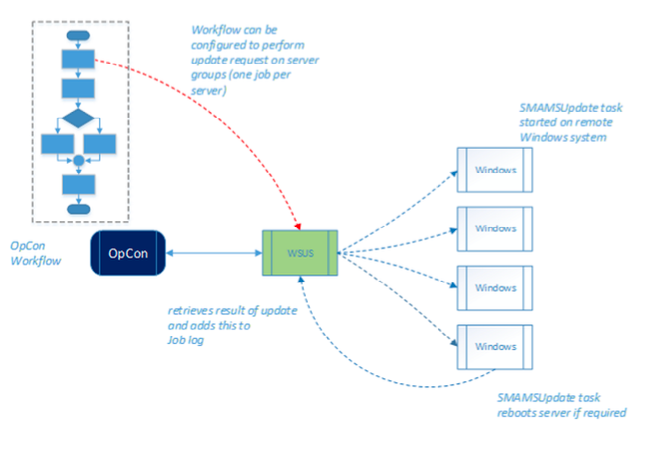

# Implementation

## What is it?

The WSUS Connector has two parts that work together to apply Windows updates from an OpCon workflow:

| Component | What it does | Where it runs |
| --------- | ------------ | ------------- |
| Server (`SMAWSUS.exe`) | Scheduled as a WSUS Windows sub-type job by OpCon. Coordinates the update process and reports results back to OpCon. | The SAM server, or any machine where it can be scheduled. |
| Client (`SMAMSUpdate.exe`) | Checks, downloads, and installs Windows updates on the target server. Optionally reboots the server. | Locally on the target server, or via a shared UNC path. |

Read this page to understand:

* How OpCon, the server component, and the client component coordinate to apply updates.
* Why the WINAT scheduler is used on each target server.
* When to deploy the client locally on each target server versus over a shared UNC path.

## Why the WINAT scheduler is required

The Windows Updates Library does not allow downloads or installs with a remote logon token. The work must run as a locally logged-on user, or as the Local System Account.

To meet this requirement, the WSUS Connector uses the built-in **WINAT scheduler** on the target server. WINAT runs the client component (`SMAMSUpdate.exe`) locally, even though OpCon is running elsewhere.

:::info Important

The Windows update library does not allow downloads or installs with a remote logon token. The work has to run as a locally logged-on user (or Local System Account). This is achieved by using the built-in WINAT scheduler.

:::

## How the update process works

1. **Schedule the task.** When the WSUS Connector starts, it schedules a WINAT task on the target server to run one minute later.
2. **Monitor the task.** The connector then monitors the status of the scheduled task.
3. **Check and install.** When `SMAMSUpdate` starts, it checks for Windows updates and optionally downloads and installs them. All activity is retained in-memory.
4. **Stream the log.** When `SMAMSUpdate` finishes, it opens a Named Pipe in listening mode. The connector connects to the pipe and retrieves the entire activity log.
5. **Reboot if needed.** Once the log is transferred, `SMAMSUpdate` optionally reboots the target server.
6. **Verify the server is back.** The connector pings the target server to confirm it is back online, then reports the job as finished to OpCon.

The connector handles servers that require multiple reboots and updates: it will keep applying updates and rebooting until all specified updates have been applied.

## Deployment options

A Microsoft Agent is **not** required on the target servers. You can choose one of two deployment patterns:

* **Shared UNC path** (recommended for environments with many target servers). Install the client component once on a network share. Each target server runs it remotely. No software is installed on the target servers.
* **Local install on each target server.** Install the client component on every target server. Use this when a shared path is not available or not permitted.

## FAQs

**Does the target server need an agent installed?**
No. The connector can run the client component over a shared UNC path with no software on the target server.

**Why is the WINAT scheduler involved?**
The Windows Updates Library only operates under a locally logged-on user or the Local System Account. WINAT runs the client locally on the target server, even when the connector itself is running elsewhere.

**What if the target server requires multiple reboots?**
The connector handles this automatically. It keeps applying updates and rebooting until all specified updates have been applied.

**How does the connector know the server came back online after a reboot?**
The connector pings the target server. Once it responds, the connector reports the job as finished.

## Glossary

| Term | Definition |
| ---- | ---------- |
| WINAT scheduler | The built-in Windows scheduler the connector uses to run `SMAMSUpdate.exe` as a locally logged-on user (or Local System Account) on the target server. |
| SMAMSUpdate | The client-side process that checks, downloads, installs Windows updates, and optionally reboots the target server. |
| Named Pipe | An inter-process communication channel used by `SMAMSUpdate` to stream its activity log back to the WSUS Connector. |
| UNC path | Universal Naming Convention path. Used to reference the shared client component from each target server. |
