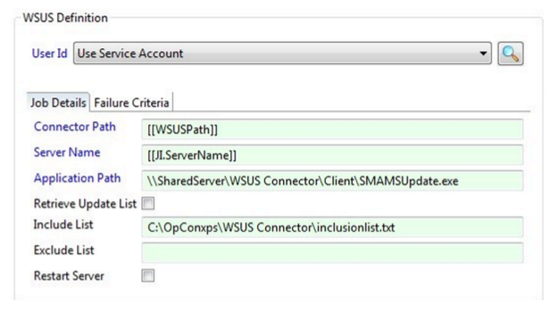
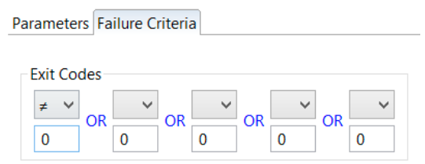
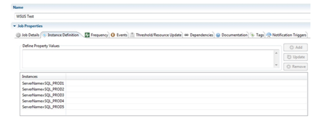
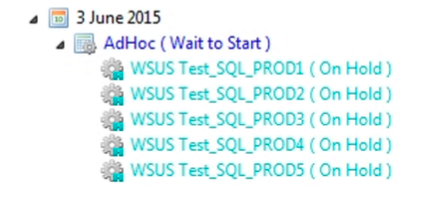

# Job Definition

The WSUS Connector includes a job sub-type to assist with the definition of WSUS jobs. When defining a job in the Enterprise Manager or the Job Type steps, make sure you:

1. Select Windows in the Job Type drop-down list.
2. Select WSUS in the Job Sub-Type drop-down list.

For more information, refer to Adding Jobs in the Enterprise Manager documentation. 

### WSUS Sub-Type

WSUS sub-type simplifies the job definition process by displaying fields to generate the command line for different supported WSUS commands.

### Job Details Tab

The fields include:

* **User ID**
    * Defines the User ID assigned to the job for Windows security authentication.
    * Define "UseServiceAccount" if the MSLSAM is running as a Domain User. For additional information on running the MSLSAM as a Domain User, refer to [Service Configuration Options](https://help.smatechnologies.com/opcon/agents/windows/administration/service-configuration) in the Microsoft LSAM documentation.
    * Define a specific Domain User if the MSLSAM is running as the Local System. For additional information on running the MSLSAM as the Local System, refer to [Service Configuration Options](https://help.smatechnologies.com/opcon/agents/windows/administration/service-configuration) in the Microsoft LSAM documentation.
    * If the User ID does not list the Domain User, register the Domain User in the Enterprise Manager.
* **ConnectorPath**
    * Defines the location of the server component that will beexecuted through the OpCon job.
* **Server Name**: 
    * Defines the server on which the updates are to be checked and/or installed.The example in the WSUS Job Definition Screen figure is using a Job Instance (JI) property.
* **Application Path**
    * Defines the path to the Client component, either on the local target server or, as in the WSUS Job Definition Screen figure, a shared UNC network path.
* **Retrieve Update List**
    * *(Optional)* Tells the connector to retrieve a list of updates that are available for the server No updates are installed. If this option is not selected, then any applicable updates are downloaded and installed.
* **Include List**
    * *(Optional)* Tells the connector to install only the updates in this file on the server.
* **ExcludeList**
    * *(Optional)* Tells the connector to installall updates for this server, except any found in the Exclude list.

The **WSUS Job Definition Screen** figure above shows the recommended way of configuring the WSUS job: a Multi-Instance job with Server Name as an instance property. This allows a single OpCon job definition to be used for any number of target servers.

### Failure Criteria Tab

The Failure Criteria tab defines the information to determine if the query was successful.

* **ExitCodes**
    * ProvidesfieldstodefinebasiccriteriaforOpContodeterminethefinalstatusofthejob. By default, all return codes not equal to 0 are considered as Failed. If any one of the criteria is TRUE at the end of a job, the OpCon reports the job as Failed. Up to five different failure criteria may be defined. A failure criterion contains two parts: Operator and Exit Code Integer:

* **Operator**
    * An exit code criterion may use one of the following operators to compare the exit code with a user-defined value.
        * **EQ** (equal to)
        * **NE** (not equal to)
        * **LT** (less than)
        * **GT** (greatert han)
        * **GE** (greater than or equal to) 
        * **LE** (less than or equal to)
* **ExitCodeInteger**
    * Any integer( -2, 147, 483, 648 through 2, 147, 483, 647) to compare with the job's exit code.

### Job Instance Definition

The **Job Instance Definition** figure below the Instance definitions for ServerName. In this case, the job is being used for five SQL Servers.

When the schedule containing this WSUS job is built, a separate job for each instance is built. Each of these jobs process independently and report back the results of the update on that Server.

The results of the update process for each server will be reflected in a WSUS exit code. A complete list of exit codes can be found in the [WSUS Connector Messages](reference-information#wsus-connector-messages) section of this documentation. OpCon events can be defined for the different exit codes so that notification, escalation, and follow-up actions can be carried out if required. The output from the connector for each job can be viewed by right-clicking on a job and selecting **View Job Output** from the menu. A suggested strategy might be to have a separate WSUS job for each Server type or QA Servers and so forth.

